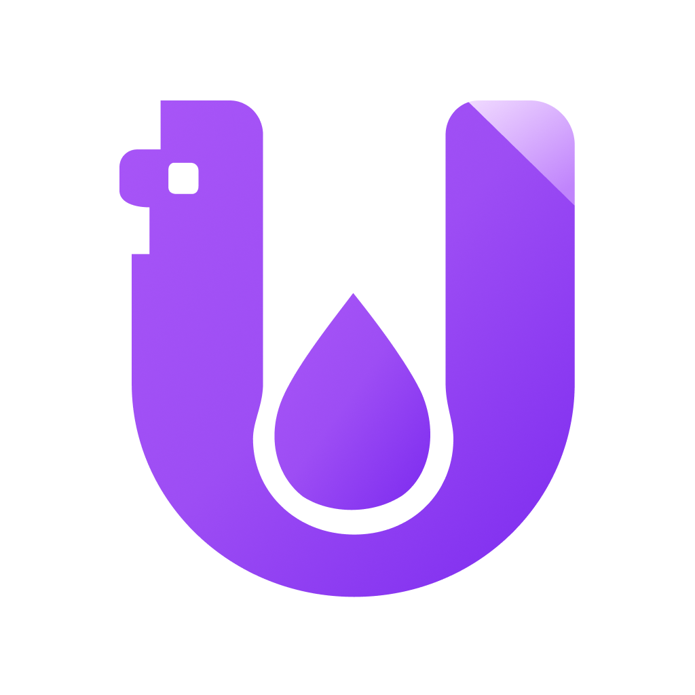

<p align="center">
  
</p>

<h1 align="center">VniDrop</h1>

<p align="center">
  <strong>Send files directly. Stay in control of who receives them.</strong>
</p>

<p align="center">
  Cross-platform file transfer for Android, iOS, macOS, Windows, and Linux.
</p>

<p align="center">
  <a href="https://github.com/vnidrop/vnidrop/actions/workflows/rust-core.yml"></a>
  <a href="https://github.com/vnidrop/vnidrop/actions/workflows/shared-kmp.yml"></a>
  
  <a href="LICENSE"></a>
</p>

VniDrop moves files and folders from one device to another without first
uploading them to a file-hosting service. Choose what to send, decide who may
receive it, and share a small invitation. The receiving device uses that
invitation to find the sender and request the files.

There is no account to create and no cloud copy of the transfer waiting after
you are done. The sender remains in control and can stop sharing at any time.

## How a transfer works

1. **Choose files or a folder.** VniDrop prepares the selection on the sender's
   device and keeps the original folder structure.
2. **Create an invitation.** The app produces a small VniDrop invitation that
   describes the transfer and how to reach the sender. Share it as a QR code, an
   NFC tag, or a `.vnd` file.
3. **Connect to the sender.** The receiver opens the invitation. Iroh helps the
   devices find each other and establishes an authenticated, end-to-end
   encrypted connection.
4. **Request access.** By default, the sender sees who wants the transfer and
   chooses whether to approve or refuse the request.
5. **Stream and verify.** After access is granted, `iroh-blobs` streams the files
   and verifies their content while it arrives. VniDrop saves each file directly
   to the chosen destination without replacing an existing file.
6. **Stay in control.** The sender can follow each receiver's progress, cancel a
   transfer, or stop sharing so the invitation can no longer be used.

Iroh tries to connect the devices directly, including across home routers and
mobile networks. If a direct path cannot be established, it can forward the
same end-to-end encrypted connection through a relay. The relay forwards
encrypted packets; it is not a VniDrop file store.

Relays are configurable in Settings. **Default relays** use the public servers
and always work across networks. **Custom relays** let self-hosters route through
their own servers instead. **Local network only** disables relays entirely — a
private, direct-only mode where transfers work between devices on the same
network but not over the internet or mobile data.

## Why Iroh and `iroh-blobs`?

VniDrop combines a networking layer with its own sharing rules:

| Layer | What it does |
|-------|--------------|
| [Iroh](https://docs.iroh.computer/) | Gives each device a secure identity, helps devices find one another, creates encrypted connections, and falls back to relays when a direct path is unavailable. |
| [`iroh-blobs`](https://docs.rs/iroh-blobs/0.103.0/iroh_blobs/) | Turns files into content-addressed, verified streams, so corrupted or unexpected data is detected while receiving. Multiple files are grouped into one collection. |
| **VniDrop** | Adds human-friendly invitations, receiver approval, per-transfer access rules, progress, history, cancellation, and safe saving on each operating system. |

Content addressing is useful here because the invitation identifies exactly
what was shared. The receiver does not simply trust a filename or claimed size:
the incoming content must match its expected hash.

## Approval is part of the transfer

A VniDrop invitation helps two devices meet, but the default invitation is not
automatic permission to download.

| Access mode | Behavior |
|-------------|----------|
| **Ask before each download** | The default. Every new receiver asks first, and the sender can approve or refuse the request. Approval gives that device temporary access to this transfer. |
| **Anyone with this transfer** | No interactive approval is required. Anyone holding the invitation may receive the files until the sender stops sharing. This mode is intended only for non-sensitive items. |

VniDrop starts from a deny-by-default position: it serves only the content in an
active share, and only when that receiver's access mode allows it. Unknown
content requests are rejected.

Treat an invitation like a private access link. Share it only with the intended
people, especially when using **Anyone with this transfer**.

## What VniDrop supports

- Individual files, multiple files, and complete folders
- QR codes, NFC tags, and portable `.vnd` invitation files
- Per-receiver requests, approvals, progress, and delivery status
- Cancel, stop sharing, and local transfer history
- Safe receive destinations that do not silently overwrite existing files
- Configurable relays: default, custom self-hosted, or local-network only
- Android, iOS, and desktop apps built from a shared Compose Multiplatform UI
- Opt-in diagnostics with transfer contents, invitations, and file paths
  excluded

## Privacy by design

- **No hosted transfer copy.** VniDrop does not upload file contents to its
  diagnostics service or a VniDrop storage bucket.
- **Encrypted in transit.** Iroh connections are authenticated and encrypted
  end to end, including when a relay is needed.
- **Local control.** Transfer history and sharing state stay on the device.
- **Sensitive invitations.** An invitation can grant access, so it is
  deliberately excluded from product logs and diagnostics.
- **Explicit access.** Approval is required by default, and stopping a share
  removes access immediately.

Please report suspected vulnerabilities through the private process in
[`SECURITY.md`](SECURITY.md), not through a public issue.

## Project status

VniDrop is in early development. The transfer engine, application experience,
and stored history format may change before a stable release. Build from source
if you want to try the current version.

```bash
git clone https://github.com/vnidrop/vnidrop.git
cd vnidrop

# Desktop
./gradlew :desktopApp:run

# Android debug build
./gradlew :androidApp:assembleDebug

# iOS
open iosApp/iosApp.xcodeproj
```

See [`CONTRIBUTING.md`](CONTRIBUTING.md) for prerequisites, development setup,
testing, and pull request guidance.

## Learn more

- [`crates/vnidrop/CORE_FLOW.md`](crates/vnidrop/CORE_FLOW.md) — protocol,
  approval, durability, and file-handling details
- [`CONTRIBUTING.md`](CONTRIBUTING.md) — development and contribution guide
- [`SECURITY.md`](SECURITY.md) — security policy and private reporting
- [`CODE_OF_CONDUCT.md`](CODE_OF_CONDUCT.md) — community standards

## License

VniDrop is available under the [Apache License 2.0](LICENSE).
